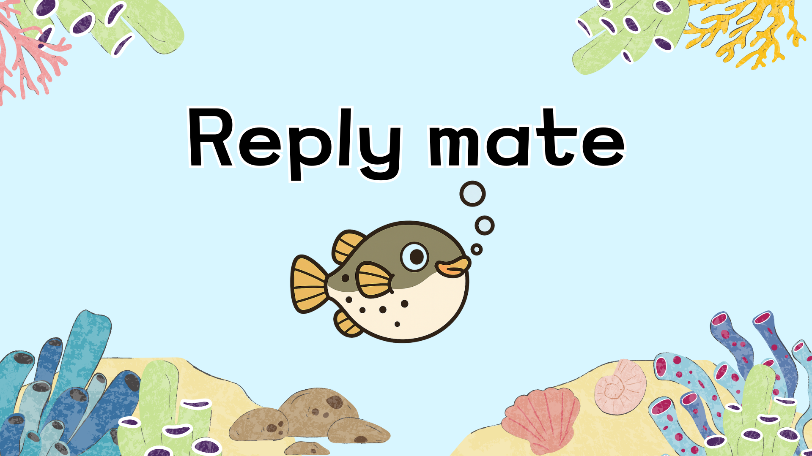
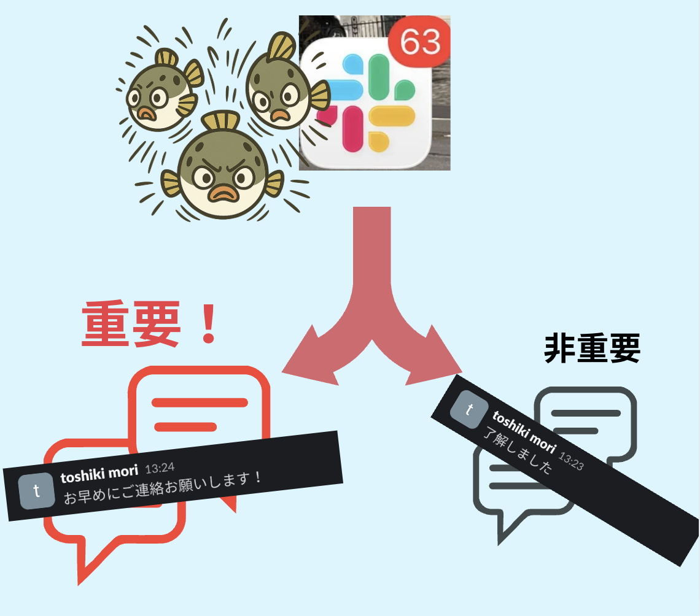
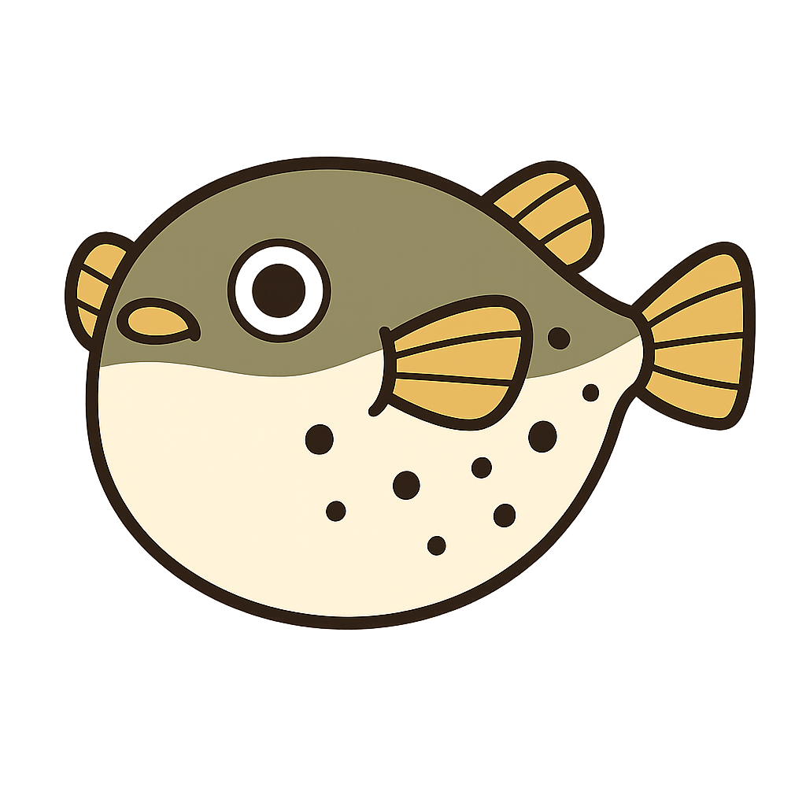
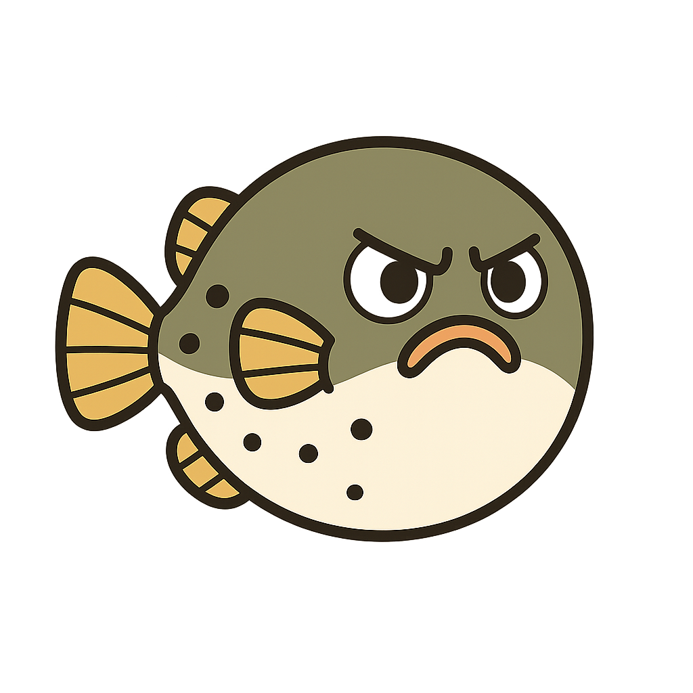
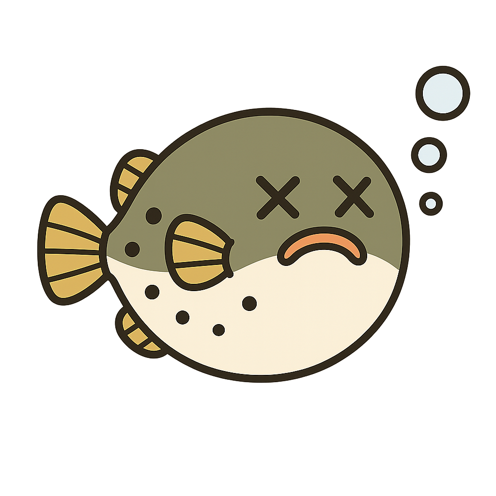
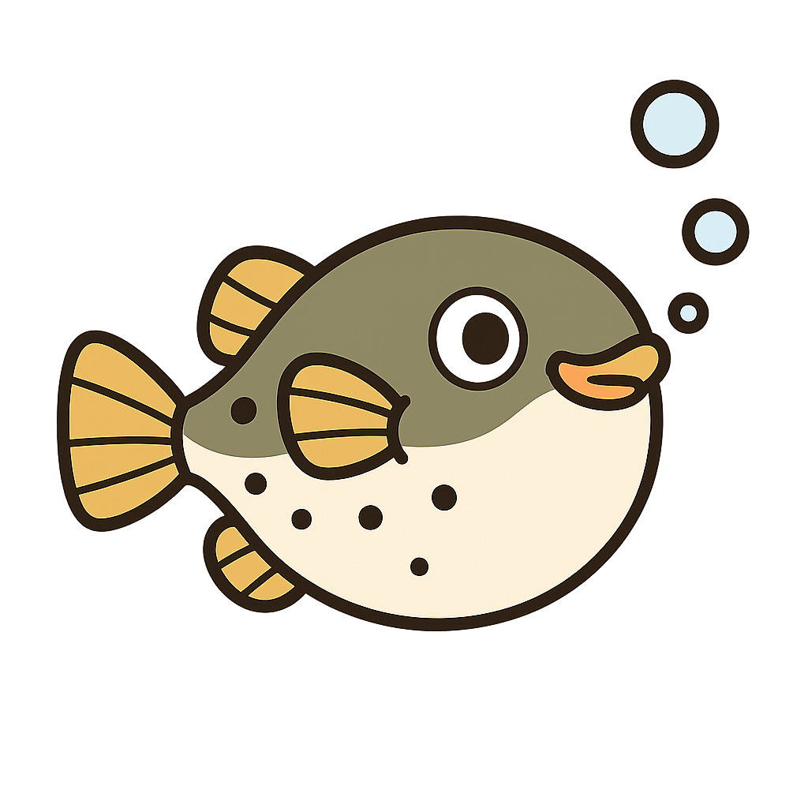
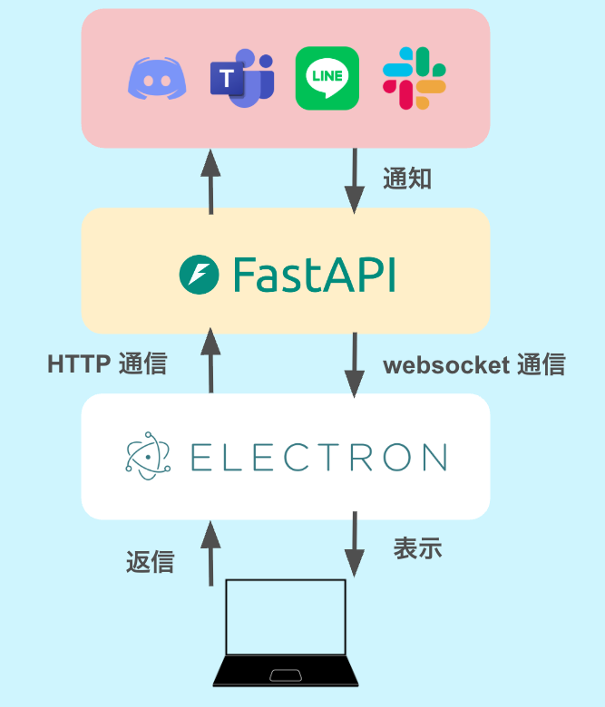

# Reply Mate - AI メッセージ返信アシスタント

<div align="center">



</div>

## 製品概要

### 製品開発の背景・課題

「あ、このメッセージ、後で返信しよう」── そう思ったまま、気づけば数日が経過していた経験はありませんか?

現代の学生や社会人は、Slack、LINE、Discord、Microsoft Teams など、複数のコミュニケーションツールを日常的に使用しています。それぞれのアプリに通知が溜まり、デスクトップには絶え間なく通知が表示されます。

しかし、問題は **「返信を後回しにすること」それ自体** ではありません。本当の問題は、**後回しにした結果、本当に重要な返信ができなくなってしまうこと**です。

**なぜ重要な返信ができなくなるのか?**

1. **複数の媒体で通知が分散**: Slack、LINE、Discord、Teams...それぞれのアプリを開くだけで時間がかかり、どこに重要なメッセージがあるか把握できません
2. **すべてのメッセージが同じ優先度**: 既存の通知システムは、緊急度に関係なくすべてのメッセージを同じように表示します。その結果、本当に重要なメッセージが大量の通知に埋もれてしまいます
3. **返信のハードルが高い**: 返信するには作業を中断し、該当アプリを開き、メッセージを確認して、文章を考えなければなりません。このステップの多さが、特に重要なメッセージへの迅速な対応を妨げています

既存の通知システムは、デスクトップに通知を表示し、アプリ上に未読を溜め込むだけ。これでは**通知疲れ**を引き起こし、**本当に返信すべき重要なメッセージを見逃すリスク**を高めてしまいます。

**私たちは、この「重要な返信ができなくなる」問題に着目しました。**

もし、複数の媒体を一括管理でき、目につきやすいデスクトップアプリで常に通知状況が確認でき、AI が緊急度を判定して本当に重要なメッセージだけを優先的に知らせてくれたら ── 返信までのステップを最小限にし、少しでも楽しく返信できるキャラクター演出があったら ── 重要なメッセージへの返信漏れを防げるのではないか。

そんな想いから、**Reply Mate**は生まれました。

### 製品説明

**Reply Mate**は、複数のコミュニケーションプラットフォームからのメッセージを一元管理し、AI が緊急度を自動判定してフィルタリングするデスクトップアプリケーションです。

可愛らしいフグのキャラクターが、受信したメッセージの数や緊急度に応じて表情や動きを変え、視覚的に通知の状態を伝えます。
また、緊急度の高いメッセージのみがリアルタイムでデスクトップ通知として表示されるため、ユーザーは重要な連絡を見逃すことなく、集中して作業に取り組むことができます。
さらに、このアプリ内から返信も行うことができるため、ユーザーはわざわざ個別コミュニケーションアプリに遷移する必要がありません。

### 特長

### 1. AI による自動緊急度判定

**Google Gemini API** や **OpenAI API** を活用し、メッセージ内容を分析します。

緊急度が**高**と判定されたメッセージのみがリアルタイム通知として表示されるため、重要な連絡に集中できます。

<div align="center">



</div>

### 2. 可愛らしいフグキャラクターによる視覚的フィードバック

| 状態                 | プレビュー                                                    | 説明                             |
| -------------------- | ------------------------------------------------------------- | -------------------------------- |
| **通常時**           |  | 可愛い表情で画面を泳ぐフグ       |
| **メッセージ蓄積時** |   | 怒った表情に変化                 |
| **5 件以上蓄積時**   |    | 困った表情で緊急性を視覚的に伝達 |
| **泳ぎ中**           |     | 左右に泳ぐアニメーション         |

### 3. アプリ内返信

Reply Mate では、受信したメッセージに対して**アプリ内でそのまま返信**することができます。

従来のメッセージ管理アプリでは、通知を確認した後、結局 Slack や LINE などの個別アプリを開いて返信する必要がありました。しかし Reply Mate なら、わざわざ他のアプリを開く必要がありません。メッセージを確認したその場で、すぐに返信を完了できます。

この機能により、**返信までのステップを大幅に削減**し、重要なメッセージへの迅速な対応を実現します。

<div align="center">


</div>

### 4. デスクトップアプリならではのセキュリティと利便性

Reply Mate は Web アプリではなく、**デスクトップアプリ**として実装しているため、セキュリティ面および利便性においてさまざまな利点があります。

#### セキュリティ面の強み

- **ローカルデータ保存**: メッセージデータはローカルで管理され、クラウド漏洩リスクを回避
- **認証情報の安全管理**: API キーやトークンを OS 環境変数で管理し、ブラウザのクッキー漏洩リスクを排除
- **通信の最小化**: AI が「高」と判定したメッセージのみを送信し、ネットワーク露出を削減

#### 利便性の強み

- **オフライン利用**: ネットワークが不安定な環境でも蓄積されたメッセージの確認が可能
- **デスクトップ常駐**: フグのキャラクターがデスクトップに常駐するため、通知の状態が直感的に分かり、かつキャラクターへの愛着が「つい返信したくなる」気持ちを後押し
- **「邪魔」を行動動機に変換**: デスクトップ常駐アプリは昔から“邪魔”になりがちですが、ReplayMate はこの課題を逆手に取ります。通知が溜まるとフグが大きくなり画面を占有。**その“邪魔”さがクリック → 返信という行動を促すトリガー**になります。

### Reply Mate で解決出来ること

| 課題                                  | 解決策                                             |
| ------------------------------------- | -------------------------------------------------- |
| 📱 **複数アプリに通知が分散**         | Slack・LINE・Discord・Teams... を 1 箇所で一元管理 |
| 🚨 **重要メッセージの見逃し**         | 緊急度が高いメッセージは確実にリアルタイム通知     |
| 👀 **通知が目立ちにくい**             | フグキャラクターの表情で未読状況を直感的に把握     |
| 💭 **返信するまでの行動の面倒くささ** | Reply Mate 内で個別アプリに返信できる              |

### 今後の展望

- **プラットフォーム拡張**: LINE・Discord・Microsoft Teams などのプラットフォームとも統合

- **AI 自動返信機能**:
  「ありがとうございます」、「承知しました」など簡単な返信で返せるメッセージは AI が自動で返信を生成

- **通知最適化**:
  メッセージの受信パターンや緊急度の傾向を分析し、重要ではないメッセージもユーザーがメールをよく確認する時間帯にまとめて通知

####

- **マルチデバイス対応**:
  スマートフォンでも同様の体験を提供

## 開発技術

### 🛠 技術スタック

<div align="left">

#### Frontend

[](https://reactjs.org/)
[](https://www.typescriptlang.org/)
[](https://www.electronjs.org/)
[](https://developer.mozilla.org/en-US/docs/Web/CSS)

#### Backend

[](https://www.python.org/)
[](https://fastapi.tiangolo.com/)
[](https://www.uvicorn.org/)

#### AI & APIs

[](https://ai.google.dev/)
[](https://openai.com/)
[](https://api.slack.com/)
[](https://firebase.google.com/)

</div>

### 📦 活用した技術の詳細

<details>
<summary><b>フロントエンド</b></summary>

| 技術                 | バージョン | 用途                           |
| -------------------- | ---------- | ------------------------------ |
| **React**            | 19.2.0     | UI 構築・状態管理              |
| **TypeScript**       | 4.9.5      | 型安全な開発                   |
| **Electron**         | 38.3.0     | デスクトップアプリケーション化 |
| **Electron Builder** | 26.0.12    | ビルド・パッケージング         |
| **Axios**            | -          | HTTP 通信                      |
| **WebSocket API**    | -          | リアルタイム双方向通信         |
| **CSS3**             | -          | アニメーション・エフェクト     |

</details>

<details>
<summary><b>バックエンド</b></summary>

| 技術        | バージョン | 用途                       |
| ----------- | ---------- | -------------------------- |
| **Python**  | 3.13+      | バックエンド言語           |
| **FastAPI** | -          | 高速 Web フレームワーク    |
| **Uvicorn** | -          | ASGI サーバー              |
| **uv**      | -          | 高速パッケージマネージャー |

</details>

<details>
<summary><b>AI・API・データ</b></summary>

| サービス               | モデル/機能          | 用途                                   |
| ---------------------- | -------------------- | -------------------------------------- |
| **Google Gemini API**  | gemini-2.5-flash     | メッセージ緊急度分析（プライマリ）     |
| **OpenAI API**         | gpt-3.5-turbo        | メッセージ緊急度分析（フォールバック） |
| **Slack API**          | Web API & Events API | メッセージ受信・イベント処理           |
| **Firebase Admin SDK** | Firestore            | ユーザー・メッセージデータ永続化       |

</details>

### システム構成図

<div align="center">



</div>

### ハッカソンで開発した独自機能・技術

ハッカソンではこのアプリを 0 から全て作成しました。その中でも特に注力した部分を以下で説明します。

#### 1. リアルタイム通信の実装

**Slack Webhook** と　サーバー・クライアント間の**WebSocket** を用いた双方向通信により、メッセージ受信から通知までをリアルタイムで動作

#### 2. キャラクターアニメーションの細部デザイン

**CSS アニメーション** × **React 状態管理** による自然な動きの実装

- フグキャラクターが自然に泳ぐ動き
- メッセージ受信時の膨らむエフェクト
- ユーザーに親しみやすく、視覚的に楽しい体験

<div align="center">


</div>

#### 3. AI による緊急度判定

**Gemini API** と **OpenAI API** を活用してメッセージ内容を元に緊急度分類を行い、重要なメッセージのみを通知

```
メッセージ内容を AI が分析
    ↓
緊急度を 3 段階で自動分類
    ↓
低 │ 中 │ 高
    ↓
高緊急度のみリアルタイム通知
```
